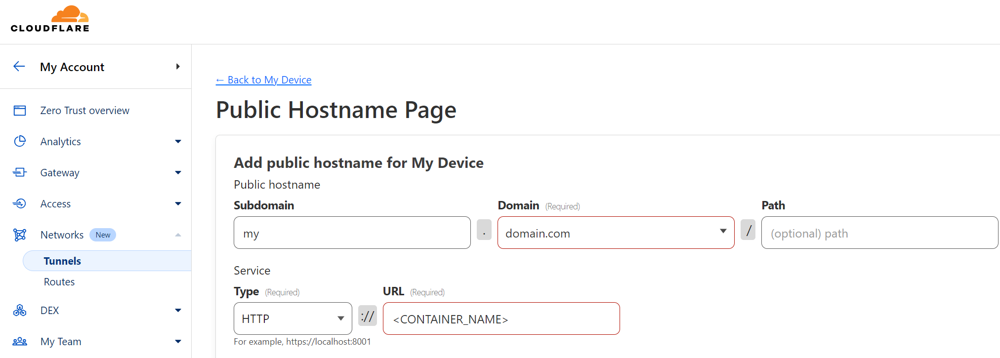
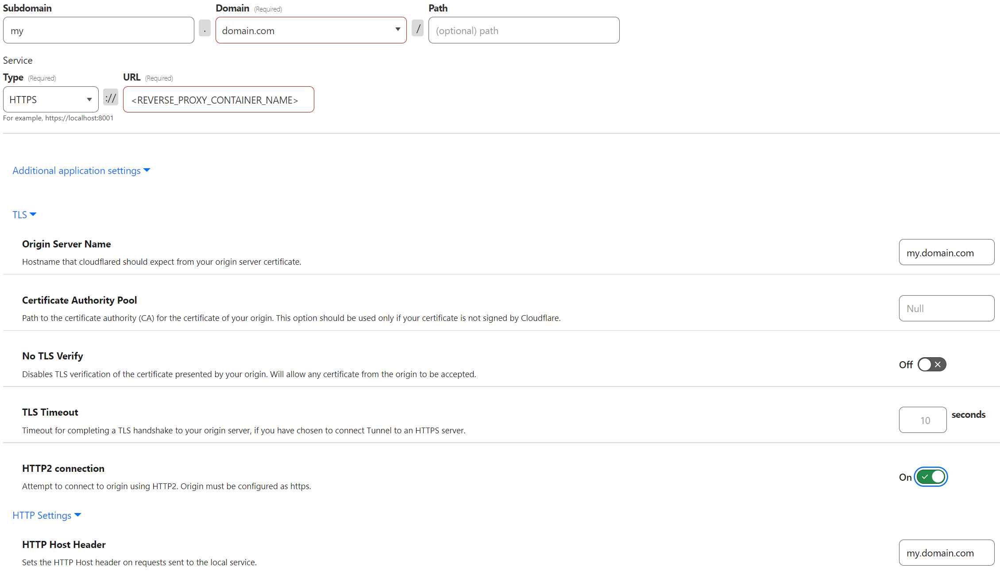

# Cloudflare Tunnel Docker Compose Configuration  

A sample Docker Compose file and brief guide for Cloudflare Zero Trust Tunnels.  

## Table of Contents  

* [Description](#cloudflare-tunnel-docker-compose-configuration)  
* [Getting Started](#getting-started)  
* [License](#license)  
* [Disclaimer](#disclaimer)  

## Getting Started  

1. Clone the repository:  

    ```shell
    git clone https://github.com/mwdle/CloudflareTunnelConfig.git
    ```  

2. Create a file called `.env` in the same directory as `docker-compose.yml` containing the following property:  

    ```properties
    TUNNEL_TOKEN=<YOUR_CLOUDFLARE_TUNNEL_TOKEN>
    ```  

3. Open a terminal in the directory containing the docker-compose file.  
4. Create a docker network for the container:  

    ```shell
    docker network create CloudflareTunnel
    ```  

5. Start the container:  

    ```shell
    docker compose up -d
    ```  

6. Attach other containers to the CloudflareTunnel network you created earlier by executing the following:  

    ```shell
    docker network connect CloudflareTunnel <CONTAINER_NAME>
    ```  

7. Configure a tunnel with a service URL that is the name of the container you want to tunnel:  
        
8. If using a reverse proxy, simply use the name of your reverse proxy container, add the Origin Server Name, HTTP Host Header and HTTP/2 like in the following example:  
        

Your container should be up and running and your tunnels should be accessible according to your configuration. Attach your reverse proxy container to the previously created Docker Network and configure it accordingly.  

## License  

This project is licensed under the GNU General Public License v3.0 (GPL-3.0). See the [LICENSE](LICENSE.txt) file for details.  

## Disclaimer  

This repository is provided as-is and is intended for informational and reference purposes only. The author assumes no responsibility for any errors or omissions in the content or for any consequences that may arise from the use of the information provided. Always exercise caution and seek professional advice if necessary.  
